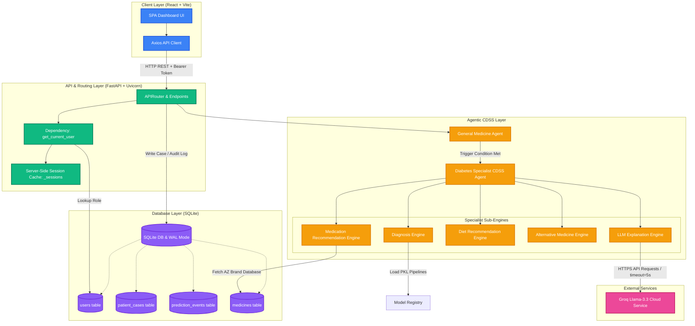
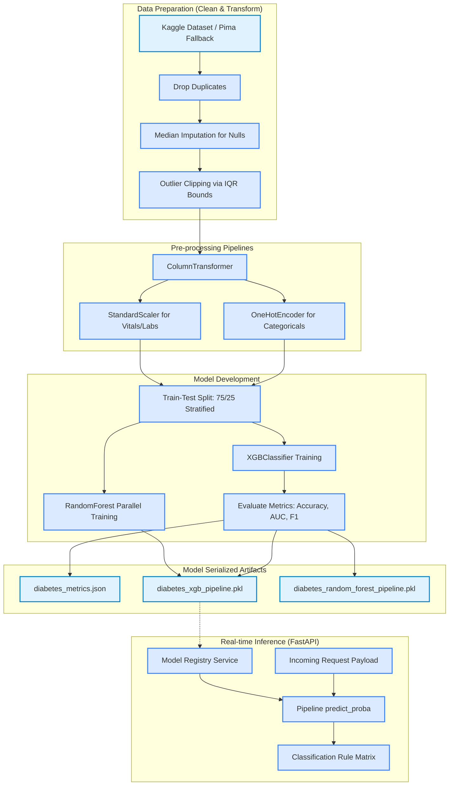
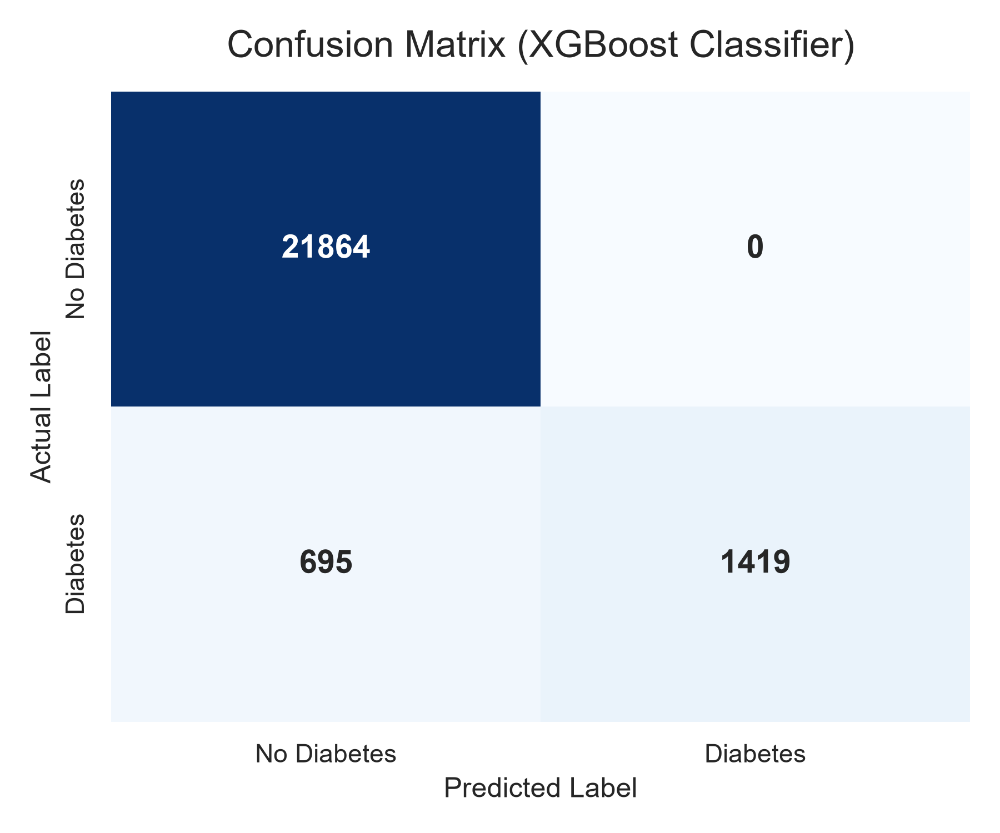
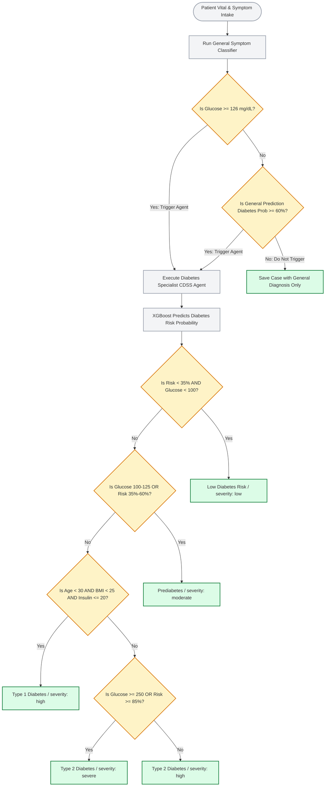
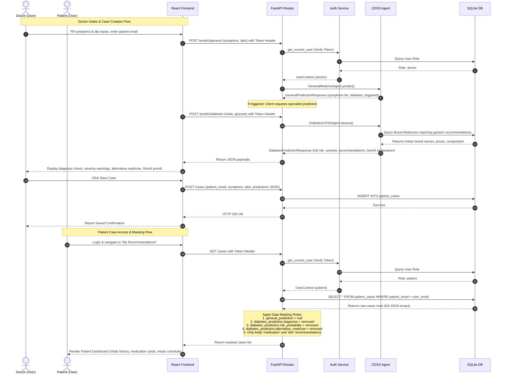
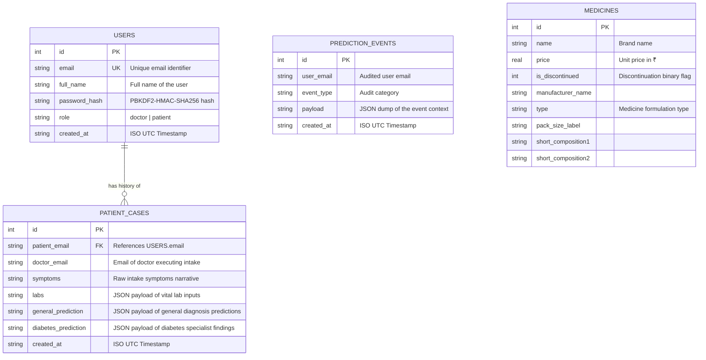

# End-to-End Technical Explanation & Architecture

This document provides a rigorous, end-to-end technical overview of the Agentic AI Healthcare Platform. It covers the system architecture, machine learning pipelines, clinical decision support rules, database optimizations, role-based access control, and startup/testing procedures.

---

## 1. System & Integration Architecture

The application implements a decoupled client-server architecture with a stateless API layer and server-side state cache, backed by an optimized relational SQLite database.



### Components Details

*   **Client Layer**: Built as a Single Page Application (SPA) using React and Vite, running by default on `http://localhost:5173`. It initiates asynchronous REST API requests over HTTP using `axios`. It contains dedicated dashboard panels for Doctors (intake form, full reports) and Patients (care recommendations view).
*   **API & Routing Layer**: Powered by FastAPI and executed using the Uvicorn ASGI server. It manages cross-origin resource sharing (CORS), applies Pydantic request-body structural validation, and evaluates role-based auth permissions using FastAPI's dependency injection (`Depends(get_current_user)`).
*   **Session Management**: Authentication tokens are generated using `secrets.token_urlsafe(32)` on login and mapped in a transient server-side dictionary memory cache (`_sessions`). This structure avoids JWT storage while remaining highly secure against token modification attacks.
*   **Database Engine**: Uses SQLite operating with **Write-Ahead Logging (WAL)** enabled (`PRAGMA journal_mode=WAL`). WAL allows multiple concurrent readers to query database records while a writer modifies tables, avoiding database locks on multi-threaded environments. Foreign key constraints are enforced (`PRAGMA foreign_keys=ON`).
*   **External LLM Integration**: The LLM Explanation Engine connects to the Groq API utilizing an asynchronous-compatible HTTP Client (`httpx.Client`) pointing to `llama-3.3-70b-versatile`. It uses a strict `5.0` second execution timeout to prevent network failures or long API waits from blocking client threads, falling back automatically to local rules-based templates.

---

## 2. Machine Learning Training & Inference Pipelines

The platform maintains two ML models: a general medicine text classification model and a specialist diabetes risk assessment model.



### 2.1 General Medicine Classifier
*   **Purpose**: Processes patient symptom descriptions to predict top-3 clinical candidate diagnoses.
*   **Data Source**: `general_symptom_disease.csv` mapping text symptoms to target conditions.
*   **Algorithm**: Logistic Regression Classifier.
*   **Text Preprocessing**: `TfidfVectorizer` mapping word tokens to TF-IDF weights:
    *   `ngram_range=(1, 2)` to capture dual-word contexts (e.g., "muscle aches").
    *   `min_df=1` to retain sparse or rare symptoms.
*   **Hyperparameters**: `C=20` (inversion of regularization strength to prevent underfitting), `class_weight="balanced"` (adjusts weights inversely proportional to class frequencies to handle imbalanced symptom classifications), and `max_iter=1200`.

### 2.2 Diabetes Risk Specialist Model
*   **Primary Data Source**: Kaggle Dataset (`iammustafatz/diabetes-prediction-dataset`).
    *   *Features*: `gender`, `age`, `hypertension`, `heart_disease`, `smoking_history`, `bmi`, `HbA1c_level`, `blood_glucose_level`.
*   **Fallback Data Source**: Pima Indian Diabetes Dataset (`pima_diabetes.csv`).
    *   *Features*: `Pregnancies`, `Glucose`, `BloodPressure`, `SkinThickness`, `Insulin`, `BMI`, `DiabetesPedigreeFunction`, `Age`.
*   **Pre-processing Pipeline**:
    1.  **Imputation**: Replaces clinical invalid placeholder zeroes (e.g., zero values in Blood Pressure or BMI) with feature medians.
    2.  **Outlier Mitigation**: Features are clipped within Interquartile Range (IQR) boundaries:
        $$\text{Lower Bound} = Q1 - 1.5 \times IQR$$
        $$\text{Upper Bound} = Q3 + 1.5 \times IQR$$
    3.  **Standardization**: Numeric features scaled to zero mean and unit variance via `StandardScaler`.
    4.  **One-Hot Encoding**: Encodes categorical variables (`gender`, `smoking_history`) via `OneHotEncoder(handle_unknown="ignore")`.
    5.  **Assembly**: Columns are encapsulated into a cohesive `ColumnTransformer` execution unit.
*   **Classifier Algorithm**: Extreme Gradient Boosting Classifier (`XGBClassifier`) with hyperparameters:
    *   `n_estimators=80` (number of boosting rounds).
    *   `max_depth=2` (maximum tree depth to limit high variance overfitting).
    *   `learning_rate=0.04` (shrinkage step size to prevent gradient descent overshoot).
    *   `subsample=0.8` (fraction of samples random-selected for tree building).
    *   `colsample_bytree=0.8` (subsample ratio of features selected per tree).
    *   `objective="binary:logistic"` (binary logistic regression loss function).
*   **Model Serialization**: Saved via `joblib` inside `diabetes_xgb_pipeline.pkl`. Model metrics (Accuracy, F1, Recall, Precision, ROC-AUC score, and Confusion Matrix) are written to `diabetes_metrics.json`.

### 2.3 Evaluation Results & Graphs

#### Confusion Matrix Plot


#### Receiver Operating Characteristic (ROC) Curve


#### Feature Importance Breakdown


### 2.4 User Interface Presentations

#### Doctor Workspace & Clinical Intake


#### Patient Care Portal


---


## 3. Clinical Decision Support System (CDSS) Trigger & Diagnosis Flow

The agent utilizes a trigger-based activation gate to determine if a comprehensive diabetes risk assessment is required, subsequently routing through clinical classification logic.



### 3.1 Gated Trigger Conditions
The system screens for diabetes triggers during the intake form check. The specialist agent is activated if **either** of these thresholds are crossed:
1.  **Direct Glycemic Trigger**: `labs.glucose >= 126` mg/dL (configured via `settings.diabetes_glucose_trigger`).
2.  **Symptom-Probability Trigger**: The General Medicine Classifier returns a prediction probability of `"Diabetes Mellitus" >= 0.60` (configured via `settings.diabetes_probability_trigger`).

### 3.2 Clinical Decision Support Classification Rules
Once triggered, the Specialist CDSS agent calculates classification categories and severity levels:
*   **Low Diabetes Risk**: Risk probability $< 0.35$ AND glucose $< 100$ mg/dL.
*   **Prediabetes**: Glucose is between $100$ mg/dL and $125$ mg/dL, OR Risk probability is between $0.35$ and $0.60$.
*   **Type 1 Diabetes**: Patient's age $< 30$ AND BMI $< 25$ AND Insulin reading $\le 20$ uU/mL.
*   **Type 2 Diabetes**: Classified if the patient does not fit the above and demonstrates elevated glucose and risk scores.
*   **Severity Gating**:
    *   `severe`: Calculated if glucose $\ge 250$ mg/dL OR Risk probability $\ge 0.85$.
    *   `high`: Default for Type 1 and Type 2 classifications.
    *   `moderate`: Default for Prediabetes classification.
    *   `low`: Default for Low Diabetes Risk classification.

---

## 4. Authentication & RBAC Lifecycle Sequence

Role-Based Access Control (RBAC) enforces distinct read/write paths for Doctors and Patients. The backend filters prediction details dynamically based on user identity.



### Data Masking & Security Logic
*   **Doctor Privileges**: Full access to all database fields. Doctors view diagnostic charts, probability curves, raw classifier predictions, alternative herbal remedies, and LLM clinical proofs.
*   **Patient Protections**: Patients are barred from viewing clinical raw assessments to prevent self-diagnosing panic.
    *   `general_prediction` is set to `null` on response serialization.
    *   Within the `diabetes_prediction` JSON block, the backend removes keys: `diagnosis`, `risk_probability`, `severity`, `model_used`, `model_metrics`, and `alternative_medicine`.
    *   Only `medication` details (prescribed drug, dosage, warnings) and `diet` plans are returned.

---

## 5. Database Schema Design & Optimization

SQLite serves as the relational datastore. The schemas are modeled below:

### 5.1 Entity Relationship Diagram (ERD)


### 5.2 Hashing & Security Policies
User password protection implements a high-iteration hash routine to block offline brute-force attacks:
*   **Algorithm**: PBKDF2-HMAC-SHA256.
*   **Salt Source**: Cryptographically secure pseudo-random bytes generated using `secrets.token_hex(16)`.
*   **Complexity**: $120,000$ iterations.
*   **Format**: `salt$hash` stored in the database.

### 5.3 Database Index Optimization
Three key database indices are implemented to ensure O(log N) lookup times during scaling:
1.  `idx_patient_cases_email` on `patient_cases(patient_email)`:
    *   *Purpose*: Speeds up dashboard retrieval times when querying patient medical histories.
    *   *Benefit*: Avoids full table scans (O(N)) during patient queries, translating into sub-millisecond retrieval speeds as patient histories expand.
2.  `idx_medicines_comp1` on `medicines(short_composition1)`:
    *   *Purpose*: Indexes the main chemical ingredient (composition) of commercial medicines.
    *   *Benefit*: Accelerates search lookups when matching generic recommended medicines (e.g., Metformin) against commercial brand names.
3.  `idx_medicines_comp2` on `medicines(short_composition2)`:
    *   *Purpose*: Indexes co-formulated active ingredients.
    *   *Benefit*: Accelerates query performance when searching for combination therapy brands (e.g., Metformin + Sitagliptin).

---

## 6. Troubleshooting & Developer Notes

### Issue A: WatchFiles Reload Storm
*   **Symptom**: Uvicorn endlessly reloaded during startup.
*   **Root Cause**: In Windows environments with OneDrive cloud-sync enabled, OneDrive continually updates folder access attributes within `.venv` upon package imports. Uvicorn's default file watcher flags these metadata adjustments as file changes, initiating infinite reloads.
*   **Solution**: `backend/main.py` dynamically checks for the presence of `.venv` and adds its absolute path directly to Uvicorn's `reload_excludes` list.

### Issue B: PowerShell Script Execution Policies
*   **Symptom**: Virtualenv scripts like `Activate.ps1` fail to execute.
*   **Solution**: Execute python commands directly from the environment using `.\.venv\Scripts\python.exe main.py` rather than activating the shell script, bypassing system policies.

### Issue C: Duplicate Database Initialization & Deprecation Warnings
*   **Symptom**: Duplicate database operations and deprecated calls during startup.
*   **Solution**: Bound database initialization routines to FastAPI's lifespan `asynccontextmanager` in `backend/main.py`, guaranteeing execution exactly once during worker thread launch.

---

## 7. Startup & Verification Guide

### 7.1 Running the Applications

1.  **Launch Backend Services**:
    ```powershell
    cd backend
    .\.venv\Scripts\python.exe main.py
    ```
2.  **Launch Frontend Services**:
    ```powershell
    cd frontend
    npm.cmd run dev
    ```
    Access the application dashboard at `http://localhost:5173`.

### 7.2 Verifying via Automated Test Suites
Run the pytest test suite in the backend folder to verify registration, logins, roles, and patient data masking:
```powershell
.\.venv\Scripts\python.exe -m pytest tests/
```
All tests should pass, confirming that RBAC is functioning correctly and data masking is successfully applied to patient roles.
