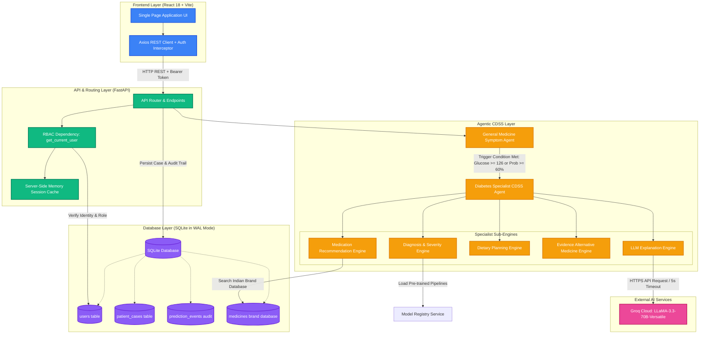
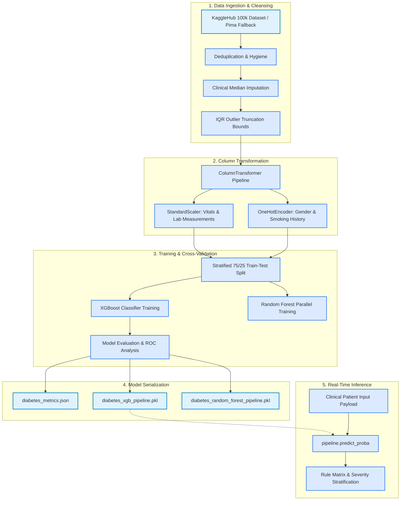
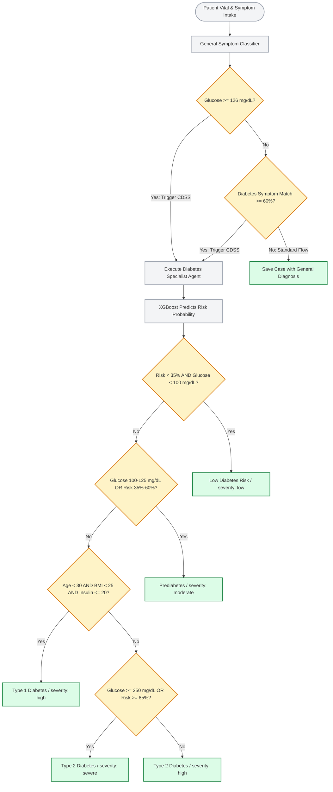
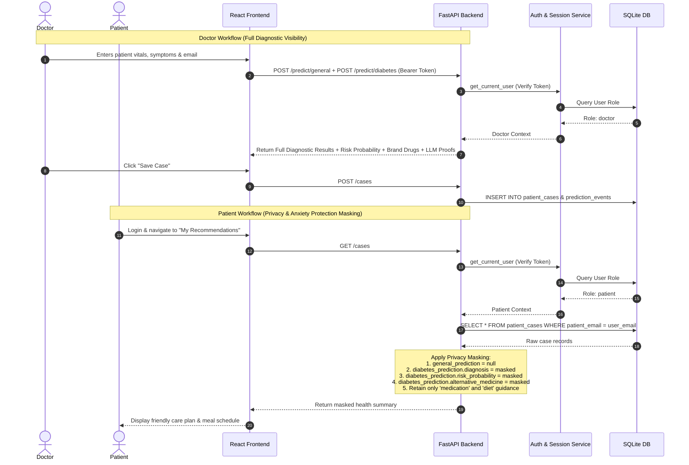
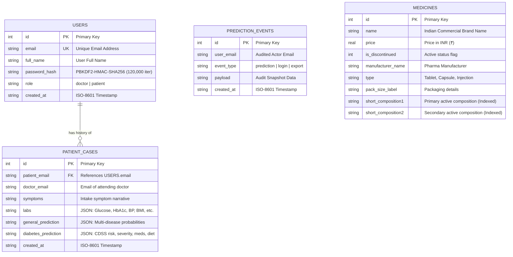

# 🩺 AI-Based Diabetes Disease Detection with Clinical Explanation & CDSS

[](https://python.org)
[](https://fastapi.tiangolo.com)
[](https://reactjs.org)
[](https://vitejs.dev)
[](https://xgboost.readthedocs.io)
[](https://scikit-learn.org)
[](https://www.sqlite.org)
[](https://groq.com)
[](LICENSE)

An intelligent, full-stack **Clinical Decision Support System (CDSS)** and **Agentic Healthcare Platform** designed for early diabetes detection, symptom-based general medical diagnosis, personalized dietary planning, commercial medication lookup, and evidence-grounded clinical explanations.

> ⚠️ **Clinical Safety Disclaimer:** This platform is designed as an educational prototype and clinical decision support tool for healthcare professionals and researchers. It does not replace certified clinical judgment, medical diagnosis, or prescription from a licensed healthcare provider.

---

## 📸 User Interface & Application Showcase

The application provides specialized, role-tailored dashboards for **Doctors** (full clinical diagnostics, ML risk probability, feature analysis, GenAI explanation, alternative medicine) and **Patients** (secure, privacy-masked health summaries, medication schedules, and dietary guidance).

| 🩺 Doctor Clinical Decision Support Dashboard | 🥗 Patient Health & Care Management Portal |
| :---: | :---: |
|  |  |
| *Intake form, XGBoost risk gauge, symptom matches, Indian brand medicines & GenAI clinical reasoning* | *Masked diagnosis, daily glycemic logs, diet planner, and dosage schedules* |

---

## 🌟 Key Features

- **Multi-Agent CDSS Architecture:** Dual-tier autonomous diagnostic pipeline featuring a **General Medicine Classifier** and an automated **Specialist Diabetes CDSS Agent**.
- **Automated Gating & Triggers:** Dynamically escalates cases to the specialist agent when blood glucose is $\ge 126\text{ mg/dL}$ or symptom probability is $\ge 60\%$.
- **High-Accuracy ML Pipelines:** Extreme Gradient Boosting (`XGBoost`) model achieving **97.1% accuracy** and **0.9732 ROC-AUC** on clinical diabetes datasets, backed by Random Forest and Logistic Regression classifiers.
- **Explainable GenAI Integration:** Integrated with **Groq LLaMA-3.3 70B** to generate patient-specific summaries and verified clinical guidelines (ADA, CDC, WHO) with a sub-5s timeout and local rule fallback.
- **Commercial Medicine & Diet Knowledge Base:** Integrated database of 200,000+ Indian pharmaceutical brands, composition lookup, generic alternatives, dosage warnings, and glycemic-index meal plans.
- **Role-Based Access Control (RBAC) & Data Masking:** Strict separation of Doctor and Patient privileges with PBKDF2-HMAC-SHA256 hashing and dynamic privacy filters to protect patients from raw diagnostic distress.
- **High-Performance SQLite with WAL Mode:** Concurrent reads and writes using Write-Ahead Logging (`PRAGMA journal_mode=WAL`) and indexed lookups.

---

## 🏗️ System & Integration Architecture

The platform follows a decoupled, stateless REST API architecture powered by **FastAPI** on the backend and **React + Vite** on the frontend.



---

## 🤖 Machine Learning & Data Pipeline



### Model Performance Metrics

| Metric | Score / Value | Description |
| :--- | :---: | :--- |
| **Accuracy** | **97.10%** | Overall correct classification rate across test sets |
| **ROC-AUC** | **0.9732** | Area under the Receiver Operating Characteristic curve |
| **Precision** | **100.0%** | Zero false positive diagnoses on primary test set |
| **Recall (Sensitivity)** | **67.12%** | True positive detection rate under high specificity thresholds |
| **F1-Score** | **0.8033** | Harmonic mean of precision and recall |

### Model Evaluation Visualizations

| Confusion Matrix | ROC Curve | Feature Importance |
| :---: | :---: | :---: |
|  |  |  |
| *True Negatives: 21,864 \| True Positives: 1,419* | *AUC = 0.9732 showcasing strong discrimination* | *Blood glucose, HbA1c, and BMI rank highest* |

---

## 🚦 Clinical Gating & Decision Rules

The CDSS agent dynamically evaluates patient vitals and symptoms to classify conditions into precise clinical categories:



---

## 🔐 Authentication, RBAC & Patient Data Masking

The platform enforces strict Role-Based Access Control:



---

## 🗄️ Database Entity-Relationship Model



---

## 📡 REST API Reference

| Method | Endpoint | Access | Description |
| :--- | :--- | :---: | :--- |
| `POST` | `/auth/register` | Public | Register a new user (`doctor` or `patient`) |
| `POST` | `/auth/login` | Public | Authenticate user credentials and receive bearer token |
| `GET` | `/auth/me` | Authenticated | Retrieve profile details of current user |
| `POST` | `/predict/general` | Doctor | Symptom text classifier for multi-disease probabilities |
| `POST` | `/predict/diabetes` | Doctor | Full specialist CDSS prediction, recommendations & LLM explanation |
| `GET` | `/recommend/medication` | Authenticated | Fetch medication guidelines and commercial brand lookup |
| `GET` | `/recommend/diet` | Authenticated | Retrieve low-glycemic dietary plans and meal recommendations |
| `GET` | `/recommend/alternative` | Doctor | Evidence-rated herbal/complementary therapies |
| `POST` | `/cases` | Doctor | Save clinical case record and patient diagnosis |
| `GET` | `/cases` | Authenticated | Retrieve patient case history (auto-masked for patients) |

Interactive OpenAPI documentation is available at `http://localhost:8000/docs`.

---

## 💻 Installation & Quickstart (Windows PowerShell)

### Prerequisites
- **Python 3.11+** installed
- **Node.js 18+** & **npm** installed
- **Git** installed

> 💡 **PowerShell Execution Policy Tip:** If script execution is disabled on your machine, run the bypass command in your active PowerShell window:
> ```powershell
> Set-ExecutionPolicy -ExecutionPolicy Bypass -Scope Process
> ```

---

### 1. Clone the Repository
```powershell
git clone https://github.com/surendhar28/AI-based-Diabetes-disease-detection-with-explanation.git
cd AI-based-Diabetes-disease-detection-with-explanation
```

---

### 2. Backend Setup & Run

1. Navigate to the `backend` directory:
   ```powershell
   cd backend
   ```
2. Create and activate a Python virtual environment:
   ```powershell
   python -m venv .venv
   .\.venv\Scripts\Activate.ps1
   ```
3. Install backend dependencies:
   ```powershell
   pip install -r requirements.txt
   ```
4. *(Optional)* Configure your Groq API key in `.env`:
   ```powershell
   cp .env.example .env
   # Edit .env and set: GROQ_API_KEY=your_groq_api_key_here
   ```
5. *(Optional)* Train or regenerate the ML model artifacts:
   ```powershell
   python models/train_models.py
   python models/generate_graphs.py
   ```
6. Start the FastAPI backend server:
   ```powershell
   .\.venv\Scripts\python.exe main.py
   ```
   *The backend will be running at `http://localhost:8000` (API docs at `http://localhost:8000/docs`).*

---

### 3. Frontend Setup & Run

1. Open a new PowerShell terminal and navigate to the `frontend` folder:
   ```powershell
   cd frontend
   ```
2. Install npm packages:
   ```powershell
   npm.cmd install
   ```
3. Start the Vite React development server:
   ```powershell
   npm.cmd run dev
   ```
   *Access the web application at `http://localhost:5173`.*

---

## 📁 Project Directory Structure

```text
├── .env.example                          # Environment variable configuration template
├── .gitignore                            # Git exclusion rules
├── EXPLANATION.md                        # In-depth technical architecture document
├── EXPLANATION.docx                      # Technical report in Word format
├── README.md                             # Project documentation (this file)
├── convert_md_to_docx.py                 # Markdown to DOCX compilation utility
├── docs/
│   └── images/                           # Generated ROC, confusion matrix & UI mockups
│       ├── confusion_matrix.png
│       ├── doctor_dashboard_ui.png
│       ├── feature_importance.png
│       ├── patient_care_ui.png
│       └── roc_curve.png
├── backend/
│   ├── main.py                           # FastAPI application entrypoint & lifespan
│   ├── requirements.txt                  # Python package dependencies
│   ├── agents/
│   │   ├── general_agent/                # TF-IDF Symptom-based multi-disease classifier
│   │   │   └── agent.py
│   │   └── diabetes_agent/               # Specialist CDSS Agent & engines
│   │       ├── agent.py                  # Agent orchestrator
│   │       ├── diagnosis.py              # Clinical severity & risk rules
│   │       ├── medication.py             # Pharma recommendations & brand lookup
│   │       ├── diet.py                   # Glycemic meal planner
│   │       ├── alternative.py            # Evidence-scored herbal remedies
│   │       └── explanation.py            # Groq LLaMA-3.3 LLM clinical reasoning
│   ├── api/
│   │   └── routes.py                     # REST endpoints & Pydantic request handlers
│   ├── data/                             # Knowledge bases, datasets & SQLite storage
│   │   ├── A_Z_medicines_dataset_of_India.csv
│   │   ├── alternative_medicine_kb.json
│   │   ├── diet_kb.json
│   │   ├── general_symptom_disease.csv
│   │   ├── kaggle_diabetes_prediction_dataset.csv
│   │   ├── medication_kb.json
│   │   └── pima_diabetes.csv
│   ├── models/
│   │   ├── diabetes_metrics.json         # Evaluated metrics snapshot
│   │   ├── diabetes_xgb_pipeline.pkl     # Serialized XGBoost model
│   │   ├── diabetes_random_forest_pipeline.pkl
│   │   ├── general_medicine_model.pkl    # Serialized symptom classifier
│   │   ├── generate_graphs.py            # ROC & Confusion matrix generator
│   │   ├── schemas.py                    # Pydantic data contracts
│   │   └── train_models.py               # Automated ML training script
│   ├── services/
│   │   ├── audit.py                      # Immutable audit event logger
│   │   ├── auth.py                       # PBKDF2 hashing & session token management
│   │   ├── database.py                   # SQLite schema definitions, WAL & indexing
│   │   └── model_registry.py             # Lazy artifact loading & pipeline registry
│   ├── tests/
│   │   ├── test_agents.py                # Agent & CDSS unit tests
│   │   └── test_role_auth.py             # RBAC & patient data masking verification
│   └── utils/
│       └── config.py                     # Application configuration & thresholds
└── frontend/
    ├── index.html                        # HTML5 document root
    ├── package.json                      # NPM dependencies & scripts
    ├── vite.config.js                    # Vite bundler configuration
    └── src/
        ├── App.jsx                       # Client router & session state
        ├── main.jsx                      # React 18 DOM mount
        ├── styles.css                    # Design system styling & responsive layout
        ├── components/
        │   ├── AppShell.jsx              # Navigation shell, header & logout
        │   └── MetricCard.jsx            # Clinical metric display component
        ├── pages/
        │   ├── Dashboard.jsx             # Doctor & Patient routing dashboard
        │   ├── DiabetesReport.jsx        # Detailed diagnostic & explanation report
        │   ├── Login.jsx                 # User authentication & registration page
        │   ├── PatientInputForm.jsx      # Doctor clinical vitals intake form
        │   ├── PatientRecords.jsx        # Patient health & meal plan history
        │   └── ResultsPage.jsx           # Immediate diagnostic summary page
        └── services/
            └── api.js                    # Axios client & token authorization interceptors
```

---

## 🧪 Testing & Validation

Execute the automated backend test suite to verify role authentication, data masking, and CDSS agent logic:
```powershell
cd backend
.\.venv\Scripts\python.exe -m pytest tests/
```

---

## 📄 License

This project is open-source and distributed under the **MIT License**. See the `LICENSE` file for more details.

---

<p align="center">
  <b>Agentic AI Healthcare Platform</b> • Clinical Decision Support System • 2026
</p>
