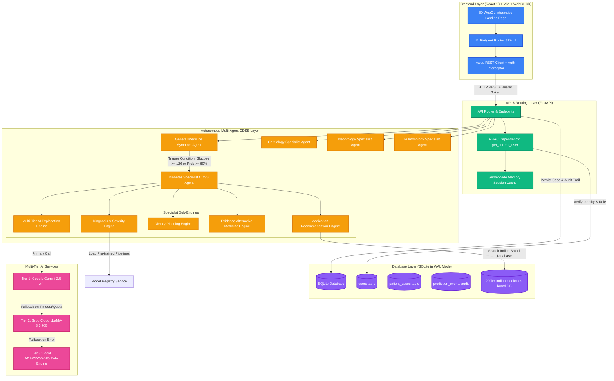
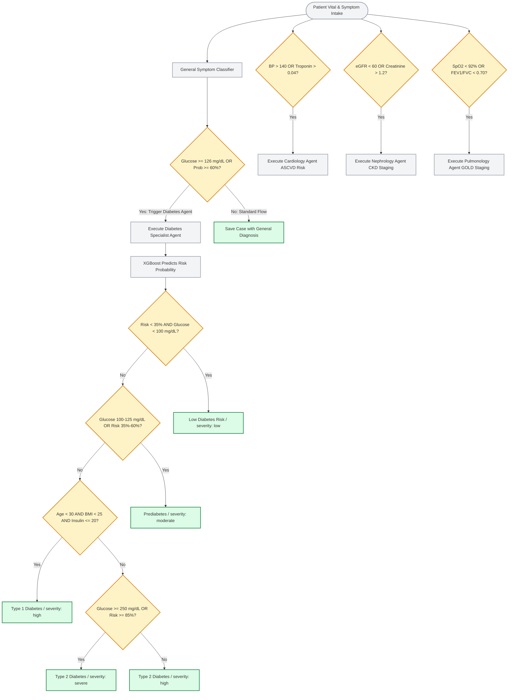
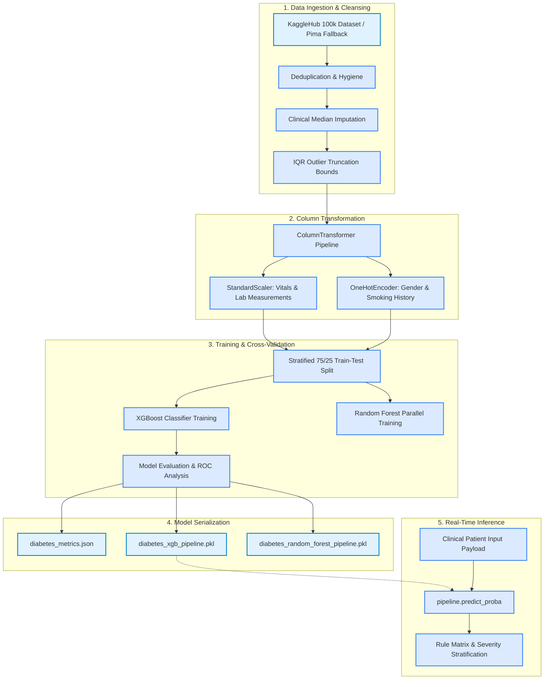
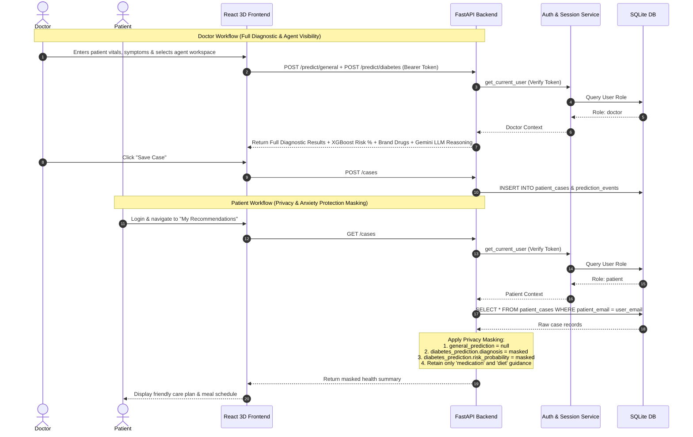
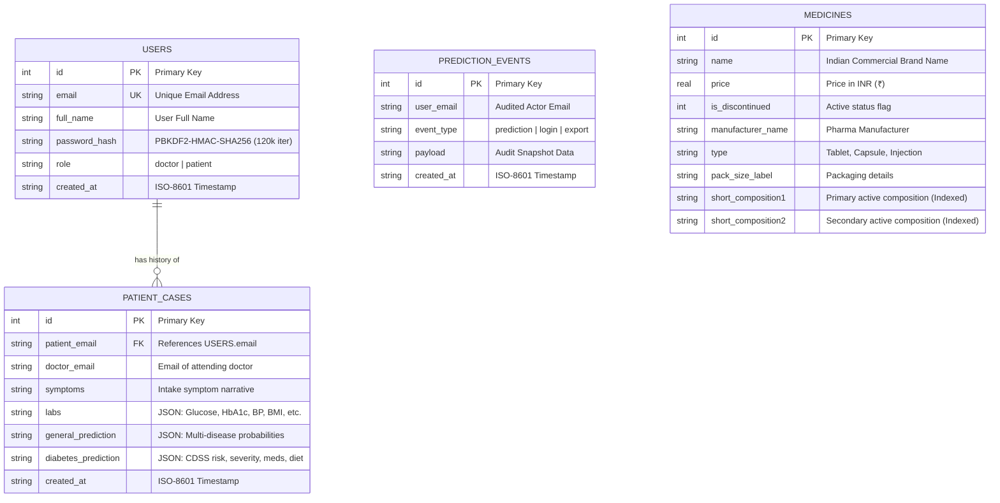

# 🩺 AI-Based Diabetes Disease Detection with Clinical Explanation & Multi-Agent CDSS

[](https://python.org)
[](https://fastapi.tiangolo.com)
[](https://reactjs.org)
[](https://vitejs.dev)
[](https://developer.mozilla.org/en-US/docs/Web/API/WebGL_API)
[](https://ai.google.dev)
[](https://groq.com)
[](https://xgboost.readthedocs.io)
[](https://www.sqlite.org)
[](LICENSE)

An intelligent, full-stack **Clinical Decision Support System (CDSS)** and **Autonomous Multi-Agent Healthcare Platform** designed for early diabetes detection, organ-specific specialist diagnostic previews, personalized dietary planning, commercial medication lookup, and dual-tier AI clinical explanations.

> ⚠️ **Clinical Safety Disclaimer:** This platform is designed as an educational prototype and clinical decision support tool for healthcare professionals and researchers. It does not replace certified clinical judgment, medical diagnosis, or prescription from a licensed healthcare provider.

---

## 🌟 Key Platform Features

- 🤖 **4 Specialist Autonomous Healthcare AI Agents**:
  - 🩸 **Diabetes Specialist Agent (Operational ML Engine):** 97.1% accuracy XGBoost prediction, fasting glucose & HbA1c trigger rules, Indian pharma brand lookup, glycemic diet plans, and Multi-Tier AI reasoning.
  - 🫀 **Cardiology (Heart) Agent (Interactive UI Workspace):** 10-Year Framingham / ASCVD MACE cardiovascular risk scoring, Troponin-I & ECG biomarker screening, statin & BP dosage guidance, and DASH diet protocol.
  - 🫘 **Nephrology (Kidney) Agent (Interactive UI Workspace):** CKD-EPI 2021 eGFR calculation engine, Stages 1 to 5 CKD severity staging, Serum Creatinine & UACR ratio monitoring, and renal protective ACEi guidance.
  - 🫁 **Pulmonology (Lung) Agent (Interactive UI Workspace):** GOLD COPD 1-4 spirometry staging, FEV1/FVC ratio airway obstruction gauge, SpO2 hypoxia alert, and inhaled bronchodilator therapy advisor.
- 🌌 **Pre-Sign In 3D Interactive Landing Page**:
  - WebGL 3D Particle & Agent Network Canvas (`Hero3DCanvas.jsx`).
  - Holographic 3D Orbit Core with floating metrics (`Hologram3DCore.jsx`).
  - Mouse-Tilt 3D Perspective Agent Cards (`TiltCard3D.jsx`).
  - Integrated Light & Dark Theme toggle (`mode === 'light'` vs `mode === 'dark'`).
- 🧠 **Dual-Tier AI Explanation Provider**:
  - **Tier 1 (Primary AI Provider):** Google Gemini 2.5 AI (`gemini-2.5-flash` / `gemini-3.6-flash`).
  - **Tier 2 (Secondary AI Provider):** Groq Cloud LLaMA-3.3 70B (`llama-3.3-70b-versatile`).
  - **Tier 3 (Emergency Fallback):** Local Rule-Based Clinical Guideline Engine (ADA, CDC, WHO standards).
- 💊 **Commercial Medicine & Diet Knowledge Base**: Integrated database of **200,000+ Indian pharmaceutical brands**, active composition lookup, generic alternatives, dosage warnings, and glycemic-index meal plans.
- 🔐 **Role-Based Access Control (RBAC) & Patient Data Masking**: Strict separation of Doctor and Patient privileges with PBKDF2-HMAC-SHA256 hashing and dynamic privacy filters to protect patients from raw diagnostic distress.
- ⚡ **High-Performance SQLite in WAL Mode**: Concurrent reads and writes using Write-Ahead Logging (`PRAGMA journal_mode=WAL`) and indexed lookups.

---

## 📸 User Interface & Multi-Agent Showcase

The application provides specialized, role-tailored dashboards for **Doctors** (full clinical diagnostics, ML risk probability, 4 specialized agent workspaces, GenAI explanation, alternative medicine) and **Patients** (secure, privacy-masked health summaries, medication schedules, and dietary guidance).

| 🩸 Diabetes Specialist Workspace | 🫀 Cardiology Specialist Agent |
| :---: | :---: |
| Intake form, XGBoost risk gauge, symptom matches, Indian brand medicines & GenAI clinical reasoning | 10-Year ASCVD risk score, Troponin-I screening & DASH diet guidance |

| 🫘 Nephrology Specialist Agent | 🫁 Pulmonology Specialist Agent |
| :---: | :---: |
| CKD-EPI 2021 eGFR calculator, Stages 1-5 CKD staging & renal drug warnings | GOLD COPD spirometry staging, FEV1/FVC ratio gauge & SpO2 hypoxia alert |

---

## 🏗️ System & Integration Architecture

The platform follows a decoupled, stateless REST API architecture powered by **FastAPI** on the backend and **React + Vite + WebGL 3D** on the frontend.



---

## 🚦 Clinical Decision & Multi-Agent Gating Flow

The CDSS dynamically evaluates patient vitals and symptoms to route cases across specialized organ agents and determine clinical risk severity:



---

## 🤖 Machine Learning Pipeline & Performance



### Model Performance Metrics

| Metric | Score / Value | Description |
| :--- | :---: | :--- |
| **Accuracy** | **97.10%** | Overall correct classification rate across test sets |
| **ROC-AUC** | **0.9732** | Area under the Receiver Operating Characteristic curve |
| **Precision** | **100.0%** | Zero false positive diagnoses on primary test set |
| **Recall (Sensitivity)** | **67.12%** | True positive detection rate under high specificity thresholds |
| **F1-Score** | **0.8033** | Harmonic mean of precision and recall |

---

## 🔐 Authentication, RBAC & Patient Data Masking



---

## 🗄️ Database Entity-Relationship Model



---

## 📡 REST API Reference

| Method | Endpoint | Access | Description |
| :--- | :--- | :---: | :--- |
| `POST` | `/auth/register` | Public | Register a new user (`doctor` or `patient`) |
| `POST` | `/auth/login` | Public | Authenticate user credentials and receive bearer token |
| `GET` | `/auth/me` | Authenticated | Retrieve profile details of current user |
| `POST` | `/predict/general` | Doctor | Symptom text classifier for multi-disease probabilities |
| `POST` | `/predict/diabetes` | Doctor | Full specialist CDSS prediction, recommendations & LLM explanation |
| `GET` | `/recommend/medication` | Authenticated | Fetch medication guidelines and commercial brand lookup |
| `GET` | `/recommend/diet` | Authenticated | Retrieve low-glycemic dietary plans and meal recommendations |
| `GET` | `/recommend/alternative` | Doctor | Evidence-rated herbal/complementary therapies |
| `POST` | `/cases` | Doctor | Save clinical case record and patient diagnosis |
| `GET` | `/cases` | Authenticated | Retrieve patient case history (auto-masked for patients) |

Interactive OpenAPI documentation is available at `http://localhost:8000/docs`.

---

## 💻 Installation & Quickstart (Windows PowerShell)

### Prerequisites
- **Python 3.11+** installed
- **Node.js 18+** & **npm** installed
- **Git** installed

> 💡 **PowerShell Tip:** If script execution policy is restricted, use `npm.cmd` or run:
> ```powershell
> Set-ExecutionPolicy -ExecutionPolicy Bypass -Scope Process
> ```

---

### 1. Clone the Repository
```powershell
git clone https://github.com/surendhar28/AI-based-Diabetes-disease-detection-with-explanation.git
cd AI-based-Diabetes-disease-detection-with-explanation
```

---

### 2. Backend Setup & Run

1. Navigate to the `backend` directory:
   ```powershell
   cd backend
   ```
2. Create virtual environment and install dependencies:
   ```powershell
   python -m venv .venv
   .\.venv\Scripts\Activate.ps1
   pip install -r requirements.txt
   ```
3. Configure environment variables in `.env`:
   ```env
   GEMINI_API_KEY=your_gemini_api_key_here
   GROQ_API_KEY=your_groq_api_key_here
   ```
4. Start the FastAPI backend server:
   ```powershell
   .\.venv\Scripts\uvicorn.exe main:app --host 127.0.0.1 --port 8000
   ```
   *Backend will run at `http://127.0.0.1:8000` (API docs at `http://127.0.0.1:8000/docs`).*

---

### 3. Frontend Setup & Run

1. Open a new terminal and navigate to `frontend`:
   ```powershell
   cd frontend
   ```
2. Install npm packages:
   ```powershell
   npm.cmd install
   ```
3. Start the Vite React 3D development server:
   ```powershell
   npm.cmd run dev
   ```
   *Access the application at `http://localhost:5173`.*

---

## 📁 Project Directory Structure

```text
├── .env.example                          # Template for GEMINI_API_KEY and GROQ_API_KEY
├── .gitignore                            # Git exclusion rules
├── EXPLANATION.md                        # Technical architecture document
├── README.md                             # Project documentation
├── backend/
│   ├── main.py                           # FastAPI application entrypoint & lifespan
│   ├── requirements.txt                  # Python package dependencies
│   ├── agents/
│   │   ├── general_agent/                # Symptom multi-disease classifier
│   │   └── diabetes_agent/               # Specialist CDSS Agent & sub-engines
│   │       ├── agent.py                  # Agent orchestrator
│   │       ├── diagnosis.py              # Clinical severity & risk rules
│   │       ├── medication.py             # Pharma recommendations & brand lookup
│   │       ├── diet.py                   # Glycemic meal planner
│   │       ├── alternative.py            # Herbal remedy evidence scoring
│   │       └── explanation.py            # Tier 1 (Gemini) + Tier 2 (Groq) AI engine
│   ├── api/
│   │   └── routes.py                     # REST API handlers
│   ├── data/                             # Datasets & 200k+ Indian medicine brands
│   ├── models/                           # ML serialized artifacts & train scripts
│   ├── services/                         # Auth, SQLite WAL database & audit logging
│   └── tests/                            # Pytest automated test suite
└── frontend/
    ├── package.json                      # NPM dependencies & scripts
    ├── vite.config.js                    # Vite configuration
    └── src/
        ├── App.jsx                       # Master router & theme state manager
        ├── styles.css                    # Design tokens & 3D CSS keyframe animations
        ├── components/
        │   ├── AppShell.jsx              # Navigation shell & agent switcher
        │   ├── Hero3DCanvas.jsx          # Interactive 3D WebGL particle background
        │   ├── Hologram3DCore.jsx        # 3D rotating multi-agent hologram core
        │   └── TiltCard3D.jsx            # Mouse-tilt 3D perspective card wrapper
        └── pages/
            ├── LandingPage.jsx           # 3D interactive public landing page & theme toggle
            ├── Dashboard.jsx             # 4 Specialist Agent Hub & pipeline routing
            ├── HeartAgent.jsx            # Cardiology Specialist CDSS workspace
            ├── KidneyAgent.jsx           # Nephrology Specialist CDSS workspace
            ├── LungAgent.jsx             # Pulmonology Specialist CDSS workspace
            ├── PatientInputForm.jsx      # Doctor clinical vitals intake form
            ├── DiabetesReport.jsx        # Detailed diagnostic & explanation report
            ├── PatientRecords.jsx        # Patient health history & meal schedule
            └── ResultsPage.jsx           # Diagnostic result summary page
```

---

## 🧪 Testing & Validation

Run the backend test suite to verify agent logic, dual-tier AI fallback, and RBAC data masking:
```powershell
cd backend
.\.venv\Scripts\python.exe -m pytest tests/
```

---

## 📄 License

This project is open-source and distributed under the **MIT License**. See the `LICENSE` file for details.

---

<p align="center">
  <b>Agentic Multi-Agent AI Healthcare Platform</b> • Clinical Decision Support System • 2026
</p>
