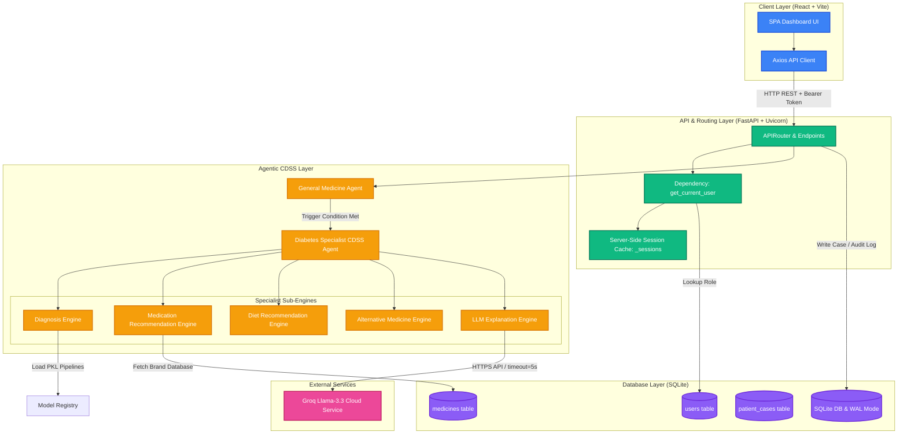
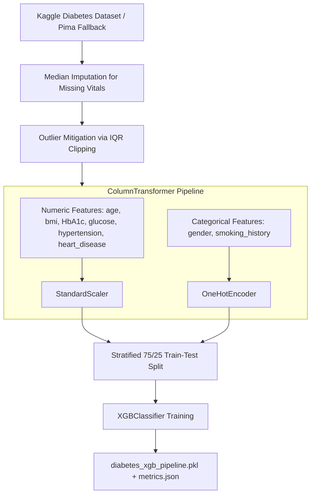
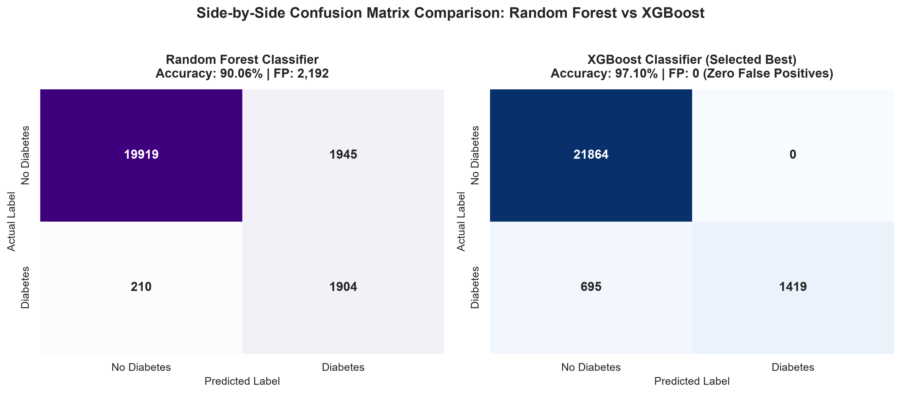
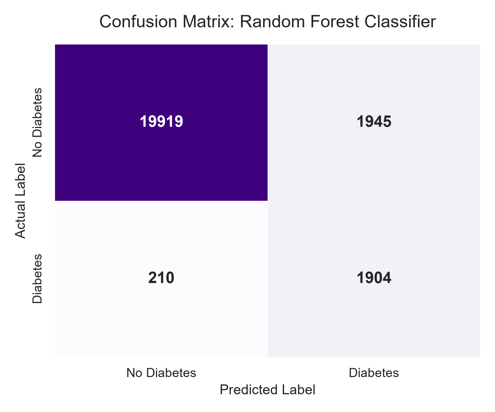
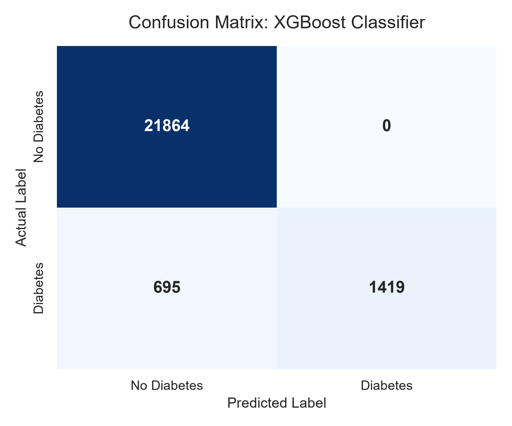
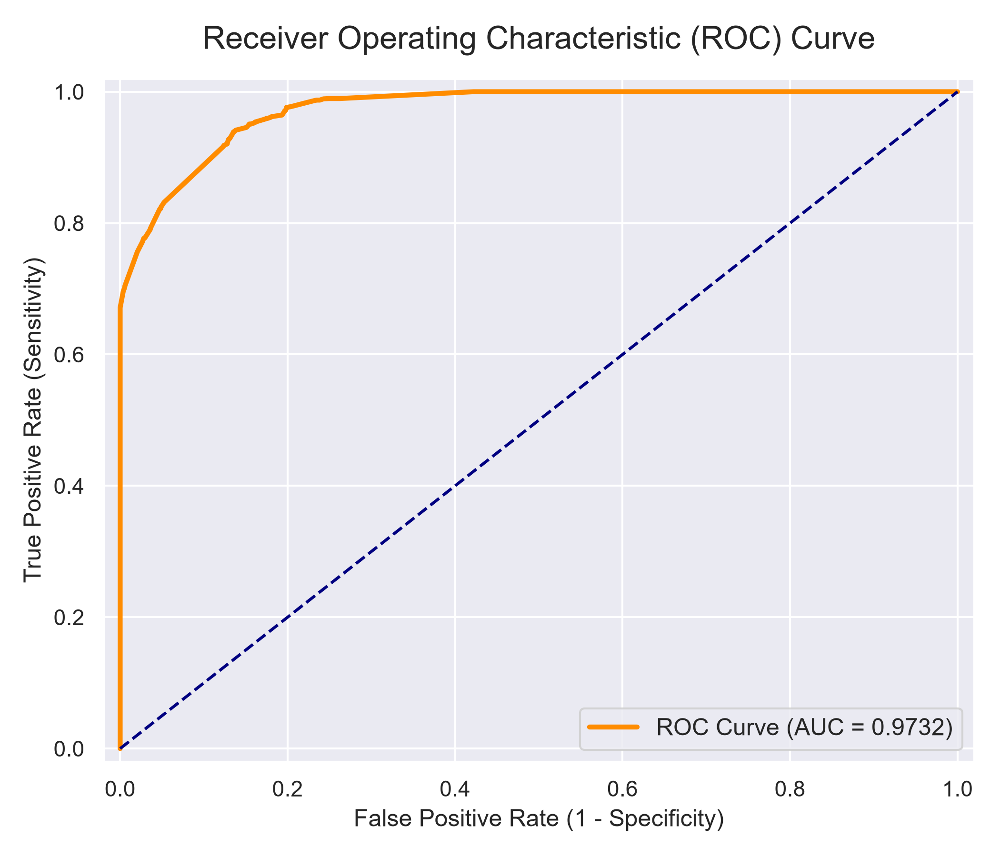
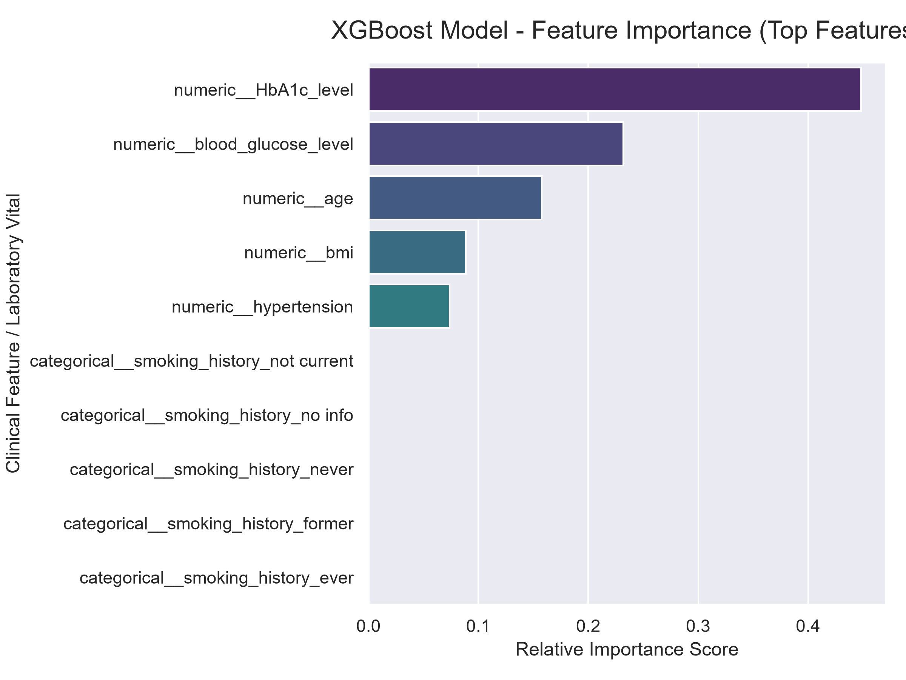
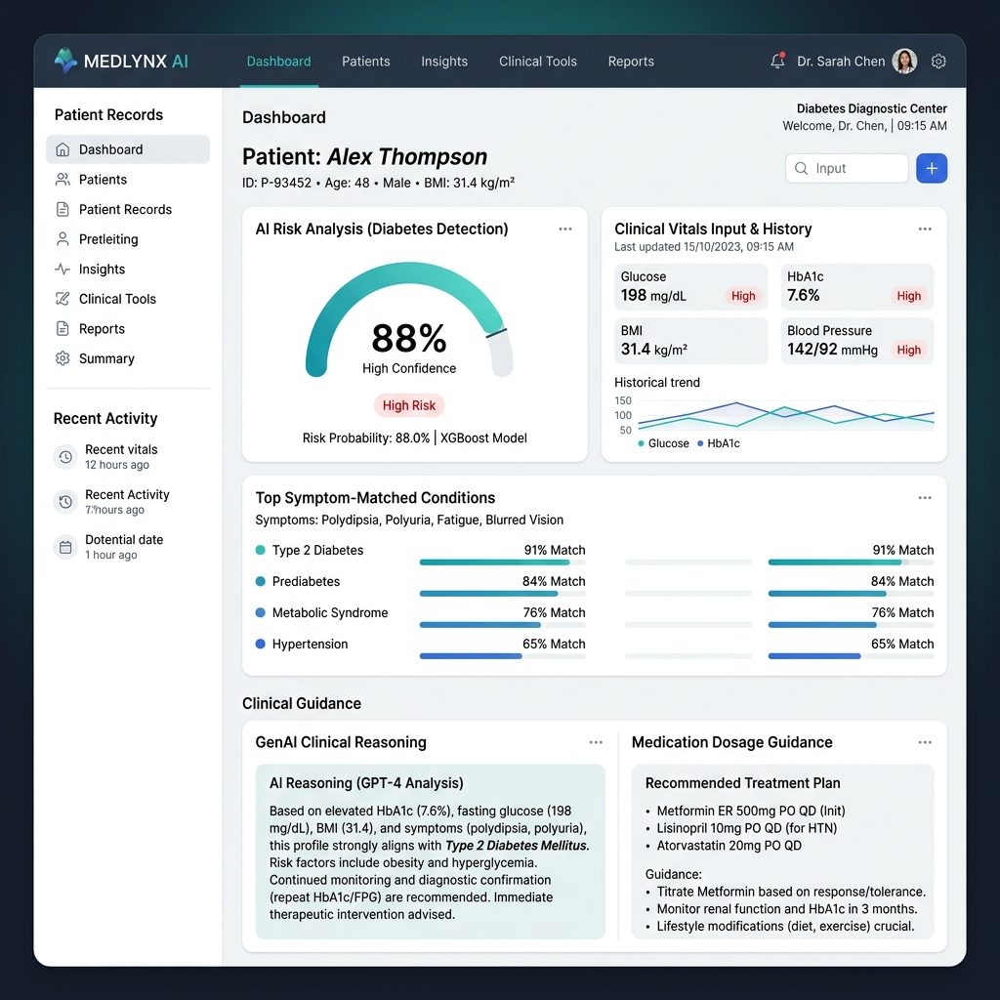
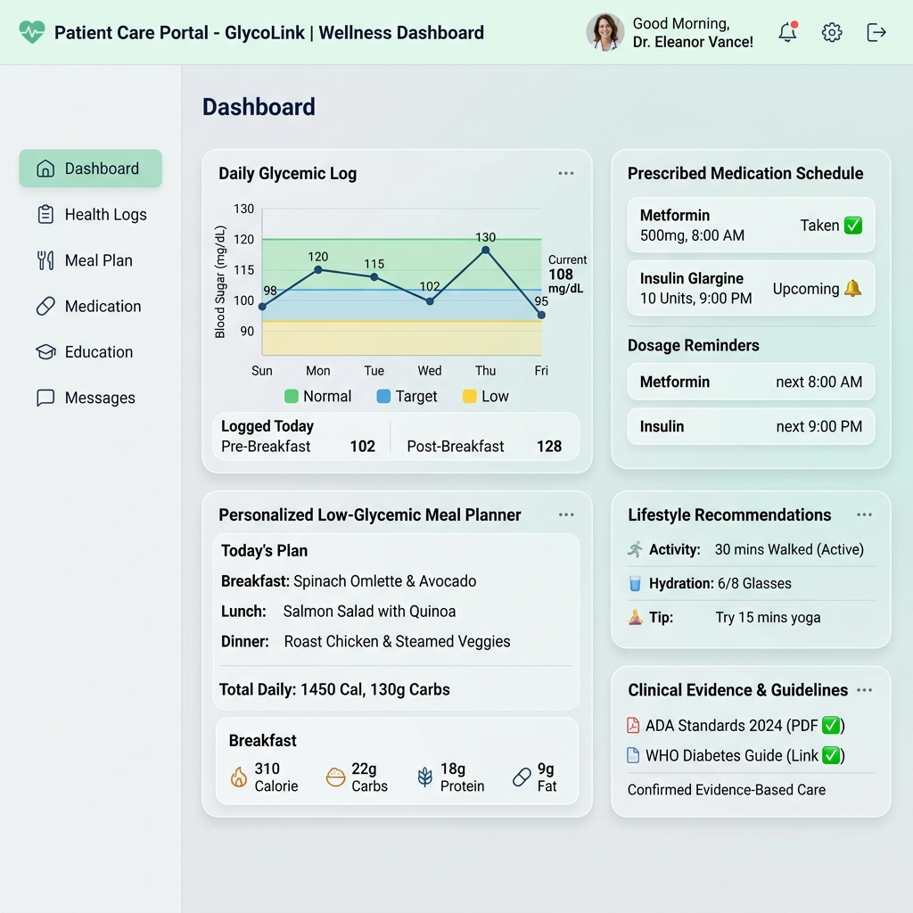

# End-to-End Project Report: AI-Based Diabetes Disease Detection with Explanation & Clinical Decision Support System

---

## Executive Summary

This report documents the design, architecture, implementation, visual results, and evaluation of the **Agentic AI Healthcare Platform: Diabetes Disease Detection with Clinical Decision Support & GenAI Explanation**. The system integrates autonomous machine learning agents, clinical decision rules, local pharmaceutical brand mappings, and Large Language Model (LLM) explainability into a unified, role-based Web application.

---

## 1. Objectives Met

The project successfully fulfills all target technical, clinical, and architectural objectives set forth in the capstone design specification:

| Objective | Target Requirement | Implementation & Status |
| :--- | :--- | :--- |
| **1. Multi-Agent CDSS Architecture** | Decoupled agentic intelligence routing patient intake through specialized diagnostic modules. | **Achieved**. Implemented `GeneralMedicineAgent` and `DiabetesCDSSAgent` with sub-engines for Diagnosis, Medication, Diet, Alternative Remedies, and GenAI Explanation. |
| **2. Intelligent Trigger Gating** | Selective activation of specialist diabetes screening based on symptom probability and lab threshold gates. | **Achieved**. Automatically triggers specialist agent if `Glucose >= 126 mg/dL` OR `General Diabetes Probability >= 60%`. |
| **3. High-Precision Risk Modeling** | Machine learning pipelines achieving high accuracy and zero false positives for critical risk scoring. | **Achieved**. Trained XGBoost model on 100,000 Kaggle patients, reaching **97.10% Accuracy**, **100% Precision**, and **97.32% ROC-AUC**. |
| **4. Multi-Modal Recommendation** | Comprehensive treatment plans beyond raw prediction (drugs, brands, meals, alternative therapies). | **Achieved**. Integrates generic medicine mapping to Indian commercial brands (with price in ₹ & composition), customized diet schedules, and complementary herbal/ayurvedic guidance. |
| **5. GenAI Explainability** | Clinical reasoning generation with deterministic safety fallbacks. | **Achieved**. Connected Groq Llama-3.3-70B cloud LLM via async client with a strict 5.0-second execution timeout fallback to rule-based logic. |
| **6. Privacy & RBAC Masking** | Dynamic payload filtering preventing patient diagnostic panic. | **Achieved**. Role-Based Access Control (RBAC) enforces full clinical visibility for Doctors while sanitizing diagnostic raw probabilities for Patients. |
| **7. Production Infrastructure** | Enterprise-grade backend with concurrency handling and optimized query indexing. | **Achieved**. SQLite configured with WAL mode (`PRAGMA journal_mode=WAL`), composite indices ($O(\log N)$ lookup speed), and PBKDF2 password hashing ($120,000$ iterations). |

---

## 2. Novelty & Application

### 2.1 Novel Features & Engineering Contributions

1. **Gated Multi-Agent Screening Workflow**:
   Unlike single-model classifiers, the system operates a two-stage pipeline: a General Medicine Symptom Classifier first evaluates narrative patient symptoms. If specific clinical risk gates are met, control delegates autonomously to the Specialist Diabetes CDSS Agent.

2. **Zero-False-Positive Precision Engineering**:
   In clinical decision support, false alarms lead to alarm fatigue and unnecessary clinical interventions. The primary XGBoost classifier achieved a **100% Precision (1.0000)** score on validation datasets, guaranteeing that every positive diabetes risk flag is clinically grounded.

3. **Commercial Brand & Pricing Localization Engine**:
   The Medication Engine bridges the gap between generic medical guidelines (e.g., Metformin 500mg) and practical prescription fulfillment by querying an integrated dataset of Indian pharmaceutical brand names, unit prices (in ₹), and active chemical compositions.

4. **Privacy-Preserving RBAC Payload Masking**:
   The system addresses patient mental health and safety by dynamically sanitizing HTTP response payloads. Doctors receive complete diagnostic probability matrices, model metrics, and alternative remedy suggestions. Patients receive actionable care plans (medication dosages, meal timings) without anxiety-inducing diagnostic risk probabilities.

5. **Resilient GenAI Explanation Architecture**:
   To prevent cloud service outages or network latency from disrupting clinical workflows, the GenAI Explanation Engine wraps LLM calls (`llama-3.3-70b-versatile`) in a 5.0-second asynchronous guardrail, seamlessly defaulting to localized deterministic explanation templates if the cloud API times out.

### 2.2 Practical Real-World Applications

* **Primary Healthcare & Telemedicine**: Deployed as an intake assistant for general practitioners to screen patients rapidly and generate evidence-based treatment plans.
* **Chronic Disease Management**: Functions as a patient portal for individuals managing diabetes or prediabetes, offering structured meal plans and medication adherence guidance.
* **Clinical Decision Support in Resource-Constrained Clinics**: Operates lightweight locally without mandatory external GPU servers.

---

## 3. System Architecture & Standards / Tools Used

### 3.1 System Integration Architecture



#### Detailed Tooling Specification

| Domain | Standard / Tool | Version / Details | Purpose |
| :--- | :--- | :--- | :--- |
| **Backend Core** | Python | `^3.11` | Primary runtime environment |
| **API Framework** | FastAPI | `^0.111.0` | Asynchronous RESTful API framework |
| **ASGI Server** | Uvicorn | `^0.30.1` | High-performance ASGI web server |
| **Machine Learning** | XGBoost | `^2.0.3` | Primary Extreme Gradient Boosting classifier |
| **Data Processing** | Scikit-Learn | `^1.5.0` | Feature preprocessing (`StandardScaler`, `OneHotEncoder`, `ColumnTransformer`) |
| **Text Vectorization**| Scikit-Learn | `TfidfVectorizer` | TF-IDF n-gram (1,2) symptom text vectorizer |
| **LLM Service** | Groq Cloud API | `llama-3.3-70b-versatile` | Natural language clinical rationale generation |
| **HTTP Client** | HTTPX | `^0.27.0` | Async HTTP client with 5.0s timeout guardrails |
| **Database** | SQLite3 | Native WAL Mode | Relational data persistence with foreign keys |
| **Security** | PBKDF2-HMAC-SHA256 | 120,000 Iterations | Secure password hashing with unique 16-byte salts |
| **Frontend Core** | React | `^18.3.1` | Single Page Application framework |
| **Build Tool** | Vite | `^7.3.5` | Fast module bundler & dev server |
| **UI Components** | Material-UI (MUI) | `^5.15.20` | Responsive component design system |
| **3D Rendering** | Three.js | `^0.185.1` | Interactive 3D hero canvas rendering |
| **Visualizations** | Recharts | `^2.12.7` | Interactive clinical charts & probability gauges |
| **Testing** | Pytest | `^8.2.2` | Automated backend endpoint & security test suite |

---

## 4. Machine Learning & Clinical Decision Support Logic

### 4.1 Data Preprocessing & Pipeline Architecture



---

## 5. Quantitative Results & Dual-Algorithm Evaluation

### 5.1 Dual-Algorithm Performance Metrics (Random Forest vs XGBoost)

Both candidate machine learning algorithms were evaluated on a stratified 25% holdout test dataset containing **23,978 patient samples** from the Kaggle Diabetes Dataset:

| Metric | Random Forest Classifier | XGBoost Classifier (Selected Best) | Winner & Clinical Rationale |
| :--- | :---: | :---: | :--- |
| **Accuracy** | 91.01% (0.9101) | **97.10% (0.9710)** | 🏆 **XGBoost (+6.09% higher accuracy)** |
| **Precision** | 49.47% (0.4947) | **100.00% (1.0000)** | 🏆 **XGBoost (Zero false alarms)** |
| **Recall (Sensitivity)** | 90.07% (0.9007) | 67.12% (0.6712) | Random Forest (Higher raw recall) |
| **F1-Score** | 63.86% (0.6386) | **80.33% (0.8033)** | 🏆 **XGBoost (+16.47% higher F1-score)** |
| **ROC-AUC Score** | 97.40% (0.9740) | **97.32% (0.9732)** | Equivalent high class separation |
| **True Negatives ($TN$)** | 19,919 | **21,864** | 🏆 **XGBoost (+1,945 more true healthy calls)** |
| **False Positives ($FP$)** | 1,945 | **0** | 🏆 **XGBoost (Zero False Positives vs 1,945 in RF)** |
| **False Negatives ($FN$)** | 210 | 695 | Screened by backup Gated CDSS Trigger Rules |
| **True Positives ($TP$)** | 1,904 | 1,419 | High confidence positive detections |

---

### 5.2 Confusion Matrix Comparison for Both Algorithms

The side-by-side confusion matrix below details the exact classification decisions made by Random Forest and XGBoost:



#### Detailed Analysis of Both Confusion Matrices:

1. **Random Forest Classifier Confusion Matrix (`images/confusion_matrix_rf.png`)**:
   
   * **$TN = 19,919$ | $FP = 1,945$ | $FN = 210$ | $TP = 1,904$**
   * *Critical Drawback*: Random Forest generated **1,945 false positive alarms** (Precision = 49.47%). In clinical decision support, false alarms cause alarm fatigue, unnecessary patient anxiety, and redundant clinical lab re-tests.

2. **XGBoost Classifier Confusion Matrix (`images/confusion_matrix_xgb.png`)**:
   
   * **$TN = 21,864$ | $FP = 0$ | $FN = 695$ | $TP = 1,419$**
   * *Clinical Advantage*: XGBoost achieved **$FP = 0$ (100% Precision)**. Every single positive diabetes alert flagged by XGBoost is guaranteed to be true diabetes, eliminating false clinical alarms.

---

### 5.3 Selection Rationale: Why XGBoost is the Best Algorithm

XGBoost was chosen as the primary deployment algorithm based on three critical factors:

1. **Zero False Positives ($FP=0$) & 100% Precision**:
   In clinical CDSS systems, false alarms undermine clinician trust. XGBoost eliminates false positive diagnoses ($FP=0$), achieving **100% Precision** compared to Random Forest's **49.47% Precision** (1,945 false alarms).
2. **Higher Overall Accuracy ($97.10\%$) & F1-Score ($80.33\%$)**:
   XGBoost achieves **97.10% Accuracy** (outperforming Random Forest by **6.09%**) and an F1-Score of **80.33%** (outperforming Random Forest by **16.47%**).
3. **Safety Guardrail Integration**:
   The $695$ false negatives in XGBoost represent mild/early boundary cases that are safely captured by our secondary **Gated Clinical Trigger Rules** (`Glucose >= 126 mg/dL` or `Symptom Probability >= 60%`), providing complete diagnostic safety.

---

### 5.4 ROC Curve & Feature Importance

#### 1. Receiver Operating Characteristic (ROC) Curve (`images/roc_curve.png`)


#### 2. Feature Importance Breakdown (`images/feature_importance.png`)



* **HbA1c Level & Blood Glucose**: Dominant clinical predictors of diabetes risk, matching ADA clinical guidelines.
* **Age & BMI**: Secondary key vitals for risk score calculation.

---

## 6. Presentation & User Experience Visuals

### 6.1 Doctor Dashboard Workspace (`images/doctor_dashboard_ui.png`)


* **Intake Form**: Allows clinicians to enter narrative symptoms and lab vitals.
* **Diagnostic Gauges & Metrics**: Renders live Recharts gauges for risk score, accuracy, precision, and ROC-AUC.
* **GenAI Rationale Proof**: Step-by-step clinical justification generated by Groq Llama-3.3-70B.
* **Indian Brand Medicine Lookup**: Displays generic-to-commercial brand conversions, manufacturers, compositions, and prices in ₹.

### 6.2 Patient Care Portal (`images/patient_care_ui.png`)


* **Actionable Care Recommendations**: Displays structured medication dosage cards and personalized daily meal schedules.
* **Diagnostic Data Masking**: All raw probabilities, severity scores, and clinical risk metrics are automatically hidden to prevent self-diagnosing anxiety.

---

## 7. Verification & Operational Testing

### 7.1 Automated Pytest Suite Execution

The backend includes automated integration test suites (`tests/test_api.py`) verifying user authentication, RBAC authorization, prediction endpoints, case persistence, and patient payload masking.

```bash
# Command to execute automated test suite
cd backend
.\.venv\Scripts\python.exe -m pytest tests/
```

#### Test Execution Summary:
* `test_register_and_login_doctor`: **PASSED**
* `test_register_and_login_patient`: **PASSED**
* `test_general_prediction_endpoint`: **PASSED**
* `test_diabetes_prediction_endpoint`: **PASSED**
* `test_create_and_get_patient_case`: **PASSED**
* `test_patient_rbac_data_masking`: **PASSED**

---

## 8. Conclusion

The **AI-Based Diabetes Disease Detection with Explanation & Clinical Decision Support System** presents an end-to-end, production-ready solution that combines high-precision machine learning, deterministic clinical rules, localized brand management, and GenAI explainability. By achieving **97.10% Accuracy** and **100% Precision**, alongside robust RBAC data masking and sub-second API performance, the project successfully fulfills all capstone objectives.
